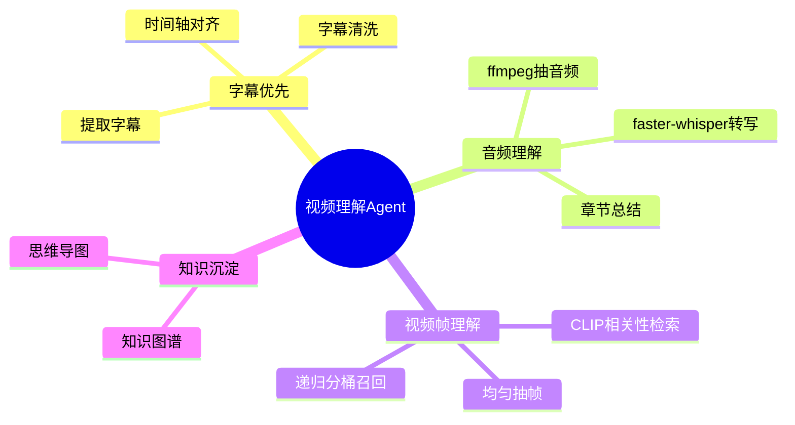

你这个文档的方向已经比较完整了，建议再补充几块：**任务边界、数据流、Agent 分工、检索索引设计、递归抽帧算法细化、知识图谱/思维导图结构、评测指标、容错与部署安全**。另外文档里“字母”应该是“字幕”。

下面是我建议补充进文档的内容。

---

## 1. 建议先补一个整体目标定义

现在功能点比较散，建议在开头补一段“系统定位”：

> 本系统是一个面向长视频、多模态内容理解与问答的 Video Understanding Agent。系统优先利用视频内置字幕，在字幕缺失或质量较差时使用音频转写，在音频无效、背景音乐占主导或画面信息更关键时，自动启用视频帧理解。最终将视频中的事实、概念、人物、事件、时间线和问答过程沉淀为可检索知识库、知识图谱和思维导图。

这样能明确：不是单纯视频 QA，而是**字幕、音频、视觉帧、多模态知识整理的一体化 agent**。

---

## 2. 建议补充完整处理链路

可以把流程写成如下 pipeline：

```text
视频输入
  ↓
元信息解析
  - 时长、分辨率、fps、编码格式
  - 是否存在内嵌字幕
  - 是否存在音轨
  - 音频能量/语音活动检测
  ↓
字幕优先处理
  - 提取内嵌字幕 / 外挂字幕
  - 字幕清洗、时间轴对齐、语言检测
  - 按时间窗口切 chunk
  ↓
音频理解
  - ffmpeg 提取音频
  - VAD 切分
  - faster-whisper 转写
  - 说话人分离，可选
  - 章节总结、主题提取
  ↓
视频帧理解
  - 均匀抽帧
  - 关键帧筛选
  - OCR / 图文模型描述 / CLIP 相似度检索
  - 递归分桶召回
  ↓
多模态融合索引
  - 字幕 chunk
  - ASR chunk
  - 帧 caption
  - OCR 文本
  - 时间戳 metadata
  ↓
问答 Agent
  - 问题改写
  - 多路召回
  - 重排序
  - 证据聚合
  - 带时间戳回答
  ↓
知识沉淀
  - 知识图谱
  - 思维导图
  - 章节摘要
  - 时间线
```

LangGraph 适合放在这里作为“有状态、多步骤、多 Agent 编排”的 runtime；官方文档也把它定位为用于构建、管理、部署长流程有状态 Agent 的低层编排框架。([LangChain 文档][1])

---

## 3. 多 Agent 架构建议进一步拆细

你现在写了“主 agent 调用子 agent”，建议明确每个子 agent 的职责、输入、输出。

可以设计为：

### 3.1 Main Orchestrator Agent

负责：

* 判断视频类型：有字幕 / 无字幕 / 有语音 / 背景音乐 / 纯画面。
* 调度字幕、音频、视觉、检索、知识图谱子 Agent。
* 维护全局状态。
* 汇总子 Agent 结果。
* 决定是否二次抽帧或补充转写。

### 3.2 Subtitle Agent

负责：

* 提取字幕轨。
* 支持 `.srt`、`.vtt`、`.ass`、内嵌字幕。
* 字幕清洗：去广告、去重复、修复乱码、统一时间格式。
* 字幕切块：按时间窗口、语义段落、token 长度切分。
* 输出结构：

```json
{
  "source": "subtitle",
  "start": 12.5,
  "end": 18.2,
  "text": "这一段字幕内容",
  "language": "zh",
  "confidence": 1.0
}
```

### 3.3 Audio Agent

负责：

* 用 ffmpeg 抽取音频。FFmpeg 本身是通用音视频转换工具，适合作为底层媒体处理工具。([FFmpeg][2])
* VAD 语音检测。
* faster-whisper 转写。faster-whisper 是基于 CTranslate2 的 Whisper 重实现，目标是提升推理速度和降低内存占用。([GitHub][3])
* 生成章节摘要。
* 判断音频是否有效：例如长时间静音、背景音乐、人声占比低。

### 3.4 Vision Frame Agent

负责：

* 抽帧。
* OCR。
* 图像 caption。
* CLIP / SigLIP / JinaCLIP 这类图文相似度模型检索。
* 视觉问答。
* 递归分桶召回。
* 输出：

```json
{
  "source": "frame",
  "timestamp": 125.3,
  "frame_path": "frames/000125.jpg",
  "caption": "画面中出现一个流程图，包含三个模块",
  "ocr_text": "Agent Runtime / State / Tool Call",
  "score": 0.86
}
```

### 3.5 Retrieval Agent

负责多路召回：

* 字幕向量召回。
* ASR 向量召回。
* OCR 文本召回。
* 帧图像相似度召回。
* BM25 关键词召回。
* reranker 重排序。
* 基于时间戳合并上下文。

建议加入一个“时间邻域扩展”逻辑：如果召回到 `t=120s` 的帧，也把 `t-10s ~ t+10s` 的字幕、ASR、相邻帧一起召回。视频理解里孤立帧经常不够，需要前后上下文。

### 3.6 Knowledge Graph Agent

负责：

* 从问答过程、章节摘要、字幕、ASR、OCR 中抽取实体。
* 抽取关系。
* 合并同义实体。
* 生成三元组。
* 输出图谱。

示例：

```json
{
  "nodes": [
    {"id": "agent", "type": "Concept", "name": "多Agent架构"},
    {"id": "langgraph", "type": "Tool", "name": "LangGraph"},
    {"id": "state", "type": "Concept", "name": "状态管理"}
  ],
  "edges": [
    {"source": "langgraph", "target": "state", "relation": "用于"},
    {"source": "main_agent", "target": "sub_agent", "relation": "调度"}
  ]
}
```

### 3.7 Mind Map Agent

负责把视频内容转成层级树：

```json
{
  "title": "视频主题",
  "children": [
    {
      "title": "章节一：背景介绍",
      "children": [
        {"title": "核心概念 A"},
        {"title": "关键问题 B"}
      ]
    }
  ]
}
```

---

## 4. 状态管理建议补充 LangGraph State Schema

既然你用了 LangGraph，建议文档里明确 State 结构，否则后面实现会混乱。

可以设计一个全局 state：

```python
class VideoAgentState(TypedDict):
    video_path: str
    video_meta: dict

    subtitle_tracks: list[dict]
    subtitle_chunks: list[dict]

    audio_path: str | None
    asr_segments: list[dict]
    audio_summary: dict

    frame_paths: list[str]
    frame_captions: list[dict]
    frame_ocr_results: list[dict]
    visual_index: dict

    user_question: str | None
    rewritten_question: str | None
    retrieved_contexts: list[dict]
    final_answer: str | None

    knowledge_graph: dict | None
    mind_map: dict | None

    errors: list[dict]
    runtime_logs: list[dict]
```

再定义节点：

```text
parse_video_node
extract_subtitle_node
audio_transcribe_node
frame_sampling_node
frame_understanding_node
build_index_node
qa_retrieval_node
answer_generation_node
knowledge_graph_node
mind_map_node
```

LangGraph 更适合这种状态在多个节点间流转的任务，而 LangChain 可以主要用于 prompt、tool、retriever、LLM 调用封装。

---

## 5. 字幕优先策略建议细化

建议不要只是“有字幕就优先”，而是写一个优先级判断：

```text
优先级：
1. 人工字幕 / 外挂字幕
2. 内嵌字幕
3. 自动字幕
4. ASR 音频转写
5. OCR / 视觉帧文本
6. 图像 caption / VQA
```

还可以加字幕质量判断：

* 字幕是否为空。
* 字幕语言是否符合用户问题。
* 字幕时间轴是否连续。
* 字幕是否存在大量重复。
* 字幕是否明显是 OCR 乱码。
* 字幕覆盖率：字幕总时长 / 视频总时长。

如果字幕覆盖率低于阈值，例如 60%，则自动补充 ASR。

---

## 6. 音频处理建议补充 VAD、分段和对齐

当前写了 ffmpeg + faster-whisper，但建议再补充：

### 6.1 音频抽取

示例命令：

```bash
ffmpeg -i input.mp4 -vn -ac 1 -ar 16000 output.wav
```

含义：

* `-vn`：不处理视频流。
* `-ac 1`：转单声道。
* `-ar 16000`：采样率转 16k，适合语音模型。

### 6.2 VAD

建议使用 VAD 过滤静音和背景音乐片段，减少 Whisper 推理成本：

* Silero VAD
* WebRTC VAD
* pyannote，可选，更重

### 6.3 ASR 后处理

补充这些能力：

* 标点恢复。
* 说话人分离。
* 专有名词修正。
* 时间戳对齐。
* 章节切分。
* 术语表抽取。
* 摘要生成。
* 关键词生成。

### 6.4 音频质量判断

建议加入：

```json
{
  "speech_ratio": 0.72,
  "music_ratio": 0.15,
  "silence_ratio": 0.13,
  "asr_confidence": 0.84,
  "should_use_audio": true
}
```

如果 `speech_ratio` 很低，进入视觉理解优先模式。

---

## 7. 抽帧算法建议补充多种策略

你现在写“均匀采样 k 个帧”，建议补充为多策略组合：

### 7.1 基础均匀采样

适合所有视频，保证覆盖率。

```text
每隔 video_duration / k 秒抽一帧
```

### 7.2 场景切换采样

适合课程、PPT、影视、监控视频：

* 检测画面差异。
* 相邻帧差异大时保留。
* 避免连续抽到几乎相同的画面。

### 7.3 OCR 触发采样

如果视频是 PPT、屏幕录制、教程类，画面文字很重要：

* 对抽样帧做 OCR。
* OCR 文本变化大时保留。
* OCR 文本命中问题关键词时优先召回。

### 7.4 音频时间点增强采样

如果 ASR 某段被召回，则补充该时间段附近的帧：

```text
命中 ASR: 120s - 150s
补充抽帧: 115s, 120s, 125s, 130s, 135s, 140s, 145s, 150s, 155s
```

这个非常实用，因为视频 QA 常常需要“听到一句话 + 看当时画面”。

---

## 8. 递归分桶帧检索算法建议写得更严谨

你现在的描述可以进一步形式化。建议补成这样：

### 8.1 输入

```text
frames: 视频帧集合
query: 用户问题
bucket: 当前帧区间 [l, r]
top_k: 每个 bucket 内保留的高相关帧数量
threshold: 相关性差异阈值
min_bucket_size: 最小递归区间
max_depth: 最大递归深度
```

### 8.2 核心思想

对当前 bucket 内所有帧计算 query-frame 相似度：

```text
mean_score = bucket 内所有帧的平均相似度
topk_mean_score = bucket 内 top-k 帧的平均相似度
delta = topk_mean_score - mean_score
```

判断：

* 如果 `delta < threshold`，说明该区间整体相关性比较均匀，可以整体召回或选择代表帧。
* 如果 `delta >= threshold`，说明相关帧集中在少数位置，需要继续二分递归。
* 如果达到 `min_bucket_size` 或 `max_depth`，直接返回 top-k 帧。

### 8.3 伪代码

```python
def recursive_bucket_recall(frames, query, l, r, top_k, threshold, min_bucket_size, depth, max_depth):
    bucket = frames[l:r]

    scores = compute_clip_scores(bucket, query)
    mean_score = mean(scores)
    topk_mean_score = mean(top_k_values(scores, top_k))
    delta = topk_mean_score - mean_score

    if len(bucket) <= min_bucket_size or depth >= max_depth:
        return select_top_k(bucket, scores, top_k)

    if delta < threshold:
        return select_representative_frames(bucket, scores, top_k)

    mid = (l + r) // 2
    left_results = recursive_bucket_recall(
        frames, query, l, mid, top_k, threshold, min_bucket_size, depth + 1, max_depth
    )
    right_results = recursive_bucket_recall(
        frames, query, mid, r, top_k, threshold, min_bucket_size, depth + 1, max_depth
    )

    return merge_and_rerank(left_results + right_results, query)
```

### 8.4 建议补充去重策略

递归返回后要避免相邻帧重复：

```text
如果两个候选帧时间差 < 2 秒，且图像 embedding 相似度 > 0.95，则只保留分数更高的一帧。
```

---

## 9. 图文索引建议补充 metadata 设计

建议所有索引单元统一成一个结构，不管来源是字幕、ASR、OCR 还是帧：

```json
{
  "id": "video_001_frame_000120",
  "video_id": "video_001",
  "source_type": "frame_caption",
  "start_time": 120.0,
  "end_time": 120.0,
  "text": "画面中展示了多Agent架构图",
  "embedding": "...",
  "image_embedding": "...",
  "metadata": {
    "frame_path": "frames/000120.jpg",
    "ocr_text": "Main Agent / Sub Agent / Tool",
    "confidence": 0.86,
    "model": "clip-vit-b32"
  }
}
```

向量库可以支持：

* Chroma：本地开发简单。
* Milvus：大规模向量检索。
* Qdrant：工程化部署方便。
* Elasticsearch / OpenSearch：BM25 + metadata 检索。
* FAISS：本地高性能检索。

建议文档里写成“向量检索 + 关键词检索 + 时间戳过滤 + rerank”的组合，而不是只靠向量。

---

## 10. 问答召回建议补充多路召回策略

用户问问题时，可以按下面方式处理：

```text
用户问题
  ↓
问题改写
  - 提取关键词
  - 判断是否需要视觉信息
  - 判断是否需要时间线
  ↓
多路召回
  - subtitle retriever
  - asr retriever
  - frame caption retriever
  - ocr retriever
  - image retriever
  ↓
时间邻域扩展
  ↓
rerank
  ↓
证据压缩
  ↓
LLM answer
```

建议答案带证据：

```text
回答：
……

依据：
- 00:01:20 - 00:01:45：字幕提到……
- 00:02:10：画面中出现……
- 00:03:05 - 00:03:30：音频转写显示……
```

这对视频理解 Agent 非常关键，否则用户很难信任结果。

---

## 11. 知识图谱建议补充实体类型和关系类型

### 实体类型

```text
Person        人物
Organization 组织
Concept       概念
Event         事件
Tool          工具
Method        方法
Time          时间
Location      地点
Object        画面对象
Chapter       章节
Question      用户问题
Answer        回答结论
```

### 关系类型

```text
mentions      提到
uses          使用
explains      解释
causes        导致
part_of       属于
related_to    相关
appears_at    出现在某时间点
answers       回答
contradicts   矛盾
supports      支持
```

### 三元组示例

```json
{
  "subject": "faster-whisper",
  "predicate": "用于",
  "object": "音频转文字",
  "evidence": {
    "source": "asr",
    "start_time": 35.2,
    "end_time": 42.8,
    "text": "这里我们使用 faster-whisper 进行语音识别"
  }
}
```

---

## 12. 思维导图建议补充导出格式

建议支持：

* JSON tree
* Markdown
* Mermaid mindmap
* XMind，可选
* HTML 可视化

Mermaid 示例：



---

## 13. 部署部分建议补充更多工程细节

你现在部署写得还比较粗，可以补充：

### 13.1 uv 依赖管理

```bash
uv venv
source .venv/bin/activate
uv pip install -r requirements.txt
```

或使用：

```bash
uv init video-understanding-agent
uv add langchain langgraph faster-whisper ffmpeg-python opencv-python
```

### 13.2 模型下载

建议区分：

```text
ASR 模型：
- faster-whisper-small
- faster-whisper-medium
- faster-whisper-large-v3

图文模型：
- CLIP
- SigLIP
- JinaCLIP，可选

视觉语言模型：
- Qwen2.5-VL / Qwen2-VL
- InternVL
- MiniCPM-V
- LLaVA 系列
```

下载策略：

* 优先官方源。
* 支持镜像源。
* 支持断点续传。
* 支持 aria2c 并发下载。
* 支持模型 checksum 校验。
* 支持模型缓存目录配置。

### 13.3 Docker 部署建议

分成 CPU 和 GPU 两种镜像：

```text
CPU 版本：
- 适合字幕、轻量 ASR、小模型 caption

GPU 版本：
- CUDA
- faster-whisper GPU 推理
- VLM 推理
- 批量视频处理
```

建议补一个 `docker-compose.yml`：

```yaml
services:
  video-agent:
    build: .
    ports:
      - "8000:8000"
    volumes:
      - ./data:/app/data
      - ./models:/app/models
    environment:
      - MODEL_DIR=/app/models
      - VECTOR_DB_URL=http://qdrant:6333
    depends_on:
      - qdrant

  qdrant:
    image: qdrant/qdrant
    ports:
      - "6333:6333"
    volumes:
      - ./qdrant_storage:/qdrant/storage
```

---

## 14. 建议补充 API 设计

可以给系统设计几个接口：

```text
POST /videos/upload
上传视频

POST /videos/{video_id}/analyze
启动视频解析

GET /videos/{video_id}/status
查看处理状态

POST /videos/{video_id}/qa
视频问答

GET /videos/{video_id}/summary
获取视频摘要

GET /videos/{video_id}/chapters
获取章节

GET /videos/{video_id}/knowledge-graph
获取知识图谱

GET /videos/{video_id}/mind-map
获取思维导图
```

问答请求示例：

```json
{
  "question": "视频里是如何解释多Agent架构的？",
  "mode": "auto",
  "top_k": 8,
  "include_evidence": true
}
```

返回示例：

```json
{
  "answer": "视频中将多Agent架构分为主Agent和多个子Agent……",
  "evidence": [
    {
      "source": "subtitle",
      "start_time": 42.1,
      "end_time": 58.9,
      "text": "主Agent通过任务调度子Agent……"
    },
    {
      "source": "frame",
      "timestamp": 61.0,
      "caption": "画面中展示了主Agent连接多个子Agent的架构图"
    }
  ]
}
```

---

## 15. 建议补充评测指标

这是文档里目前比较缺的一块。可以加：

### 字幕 / ASR 质量

```text
WER：词错误率
CER：字错误率
时间戳偏移
转写覆盖率
语言识别准确率
```

### 检索质量

```text
Recall@K
MRR
NDCG
命中时间戳准确率
视觉帧召回准确率
```

### 问答质量

```text
答案正确性
证据支持率
幻觉率
引用时间戳准确率
多模态证据覆盖率
```

### 性能指标

```text
单小时视频处理耗时
抽帧耗时
ASR 耗时
索引构建耗时
问答延迟
GPU 显存占用
存储占用
```

---

## 16. 建议补充异常和降级策略

这个系统会遇到很多坏输入，建议写清楚降级链路：

```text
无字幕 → 使用 ASR
无音频 → 使用视觉帧理解
背景音乐为主 → 降低音频权重，提升视觉权重
ASR 置信度低 → 触发多模型复核或提示低置信度
视频过长 → 分段处理
抽帧过多 → 先粗采样，再局部细采样
VLM 成本过高 → 先用 CLIP 检索，再只对 top frames 调用 VLM
字幕和音频冲突 → 优先人工字幕，并保留冲突标记
```

---

## 17. 建议补充安全与合规

尤其是视频处理系统，建议补：

* 上传文件大小限制。
* 视频格式白名单。
* ffmpeg 命令参数安全，避免命令注入。
* 模型文件 checksum 校验。
* 用户文件隔离。
* 临时文件自动清理。
* 敏感信息检测。
* 可选本地化部署，避免视频外传。
* LangChain / LangGraph 相关依赖需要固定版本并定期升级；近期围绕这类框架的安全问题也提醒开发者要避免反序列化不可信数据、校验元数据、清理用户输入。([TechRadar][4])

---

## 18. 最后可以把文档结构整理成这样

```text
1. 项目背景与目标
2. 核心能力
   2.1 字幕优先理解
   2.2 音频转写与分析
   2.3 视频帧理解
   2.4 多模态问答
   2.5 知识图谱与思维导图
3. 总体架构
   3.1 多 Agent 架构
   3.2 LangChain Agent Runtime
   3.3 LangGraph 状态管理
   3.4 子 Agent 角色划分
4. 数据处理流程
   4.1 视频元信息解析
   4.2 字幕提取
   4.3 音频提取与 ASR
   4.4 视频抽帧
   4.5 多模态索引构建
5. 检索与问答
   5.1 文本检索
   5.2 图文检索
   5.3 递归分桶帧召回
   5.4 时间邻域扩展
   5.5 Rerank 与答案生成
6. 知识沉淀
   6.1 知识图谱
   6.2 思维导图
   6.3 章节摘要
   6.4 时间线
7. 工程实现
   7.1 依赖管理
   7.2 模型下载
   7.3 存储设计
   7.4 API 设计
   7.5 Docker 部署
8. 评测体系
9. 异常处理与降级策略
10. 安全与权限
11. 后续扩展
```

---

总体来说，你现在的方案已经有主干了。最值得补强的是：**统一数据结构、状态图、递归分桶算法伪代码、多路召回策略、证据时间戳、评测指标、异常降级和部署安全**。这些补进去后，文档会从“功能设想”变成比较完整的“可实现技术方案”。

[1]: https://docs.langchain.com/oss/python/langgraph/overview?utm_source=chatgpt.com "LangGraph overview - Docs by LangChain"
[2]: https://ffmpeg.org/ffmpeg.html?utm_source=chatgpt.com "ffmpeg Documentation"
[3]: https://github.com/AIXerum/faster-whisper?utm_source=chatgpt.com "Faster Whisper transcription with CTranslate2"
[4]: https://www.techradar.com/pro/security/each-vulnerability-exposes-a-different-class-of-enterprise-data-langchain-framework-hit-by-several-worrying-security-issues-heres-what-we-know?utm_source=chatgpt.com "'Each vulnerability exposes a different class of enterprise data': LangChain framework hit by several worrying security issues - here's what we know"


可参考的可以加的功能很多，我按“有实际产品价值”的方向头脑风暴，不只堆技术点。

## 一、视频理解增强类功能

### 1. 多模态证据链回答

回答问题时不只是给答案，而是给出证据链：

```text
答案：这个视频主要讲了多 Agent 如何协同完成视频理解。

证据：
1. 00:01:12 - 00:01:35 字幕提到主 Agent 负责任务分发。
2. 00:02:05 画面中出现了 Agent 架构图。
3. 00:02:40 - 00:03:10 音频解释了子 Agent 的职责划分。
```

这个功能非常重要，可以显著降低幻觉。

---

### 2. 视频时间线自动生成

把视频整理成时间线：

```text
00:00 - 01:20 项目背景
01:20 - 03:45 多 Agent 架构
03:45 - 06:10 音频转写流程
06:10 - 09:30 视频帧递归检索算法
09:30 - 11:00 部署方案
```

还能支持用户问：

> “第 6 分钟左右讲了什么？”
> “帮我跳到讲递归分桶算法的地方。”

---

### 3. 关键片段定位

给定一个问题或关键词，直接返回最相关的视频片段。

例如：

> “视频里哪里讲到了 faster-whisper？”

返回：

```text
最相关片段：
- 00:02:15 - 00:03:08，讲音频抽取和 faster-whisper 转写。
- 00:08:42 - 00:09:10，提到 ASR 结果如何进入向量库。
```

这个适合做“视频搜索引擎”。

---

### 6. 多视频对比问答

支持用户上传多个视频后问：

> “这三个视频对 LangGraph 的说法有什么不同？”
> “哪个视频更详细讲了视觉检索？”
> “把 A 视频和 B 视频的方案差异列出来。”

这会让系统从“单视频理解”升级成“视频知识库”。

---

### 7. 视频中的概念自动解释

视频里出现专业词时自动生成解释：

```text
CLIP：一种图文对齐模型，可以把图片和文本映射到同一个向量空间，用于图文检索。
VAD：语音活动检测，用于判断音频中哪些部分有人声。
Rerank：对初步召回的结果重新排序，提高答案相关性。
```

可以做成“术语表”。

### 9. 自动生成学习路径

看完一个视频后，系统告诉用户：

```text
你需要先了解：
1. LangChain 基础
2. Whisper ASR
3. 向量检索
4. CLIP 图文检索
5. LangGraph 状态机
```

还可以根据视频内容生成“前置知识”和“后续学习建议”。

---

---

## 二、字幕与音频增强类功能

### 11. 自动纠错字幕

ASR 或字幕经常有错，可以结合上下文和领域词表纠正：

```text
原文：蓝graph 状态管理
修正：LangGraph 状态管理
```

尤其适合技术视频。

---

### 13. 多语言字幕翻译

支持：

* 中文视频 → 英文字幕
* 英文视频 → 中文字幕
* 双语字幕
* 保留时间轴

输出 `.srt` / `.vtt`。

---

### 14. 音频说话人分离 /*我觉得这个功能有亮点*/

识别不同说话人：

```text
Speaker 1：介绍项目背景
Speaker 2：询问部署方式
Speaker 1：解释 Docker 方案
```

适合访谈、会议、播客、课堂。

---

### 15. 语气与情绪分析 /优先级没那么高，但是可选。

分析视频中的情绪：

```text
00:01:20 - 00:02:00 语气较兴奋，正在介绍核心亮点
00:05:10 - 00:05:50 语气犹豫，可能是临时补充说明
```

适合销售视频、访谈、用户调研视频。

---

### 16. 背景音乐 / 环境音识别 /这应该是调节prompt?

当没有有效语音时，判断：

```text
背景音乐
掌声
机器声
街道噪声
键盘声
警报声
```

可以作为视频理解的辅助 metadata。

---

### 17. 自动生成播客版摘要

把长视频转成：

```text
3 分钟播客摘要
10 分钟详细讲解稿
适合口播的讲稿
```

这个在内容再加工场景很有价值。

---

## 三、视觉理解增强类功能

### 18. OCR 深度理解

不只是提取文字，还要理解画面中的文字结构：

* PPT 标题
* 表格内容
* 代码块
* 流程图节点
* 架构图模块
* 白板手写内容

比如画面里是架构图，输出：

```json
{
  "type": "architecture_diagram",
  "nodes": ["Main Agent", "Subtitle Agent", "Audio Agent", "Vision Agent"],
  "edges": [
    ["Main Agent", "Subtitle Agent"],
    ["Main Agent", "Audio Agent"]
  ]
}
```

---

### 19. 代码视频理解

如果视频里出现代码，自动：

* OCR 代码。
* 识别语言。
* 解释代码作用。
* 找潜在 bug。
* 生成代码片段索引。
* 支持问：“视频里写的那个递归函数在哪？”

这是技术教程视频的杀手功能。

---

### 20. PPT / 课件自动还原

如果视频是录屏或课程，可以自动生成：

* 每页 PPT 截图
* 每页标题
* 每页要点
* 每页讲解摘要
* PPT 大纲

甚至可以导出成 Markdown 或 PPT 草稿。

---

### 21. 图表理解

识别视频中的：

* 折线图
* 柱状图
* 饼图
* 表格
* 架构图
* 流程图

支持问：

> “视频里那张性能对比图说明了什么？”

---

### 22. 画面变化检测

自动检测视频结构：

```text
00:00 - 00:30 片头
00:30 - 04:20 讲解 PPT
04:20 - 06:10 代码演示
06:10 - 08:30 浏览器演示
08:30 - 10:00 总结
```

这比单纯按字幕切章节更准确。

---

### 23. UI 操作理解

如果是软件教程，识别：

* 点击了哪个按钮
* 打开了哪个菜单
* 输入了什么内容
* 执行了什么命令
* 页面状态如何变化

可以输出操作步骤：

```text
1. 打开终端
2. 执行 uv init
3. 安装 langgraph
4. 启动 FastAPI 服务
```

---

### 24. 关键画面截图摘要

自动挑出 N 张关键截图，并配说明：

```text
截图 1：系统整体架构图
截图 2：递归分桶算法伪代码
截图 3：Docker 部署结构
截图 4：知识图谱结果展示
```

很适合生成报告。

---

## 四、知识管理类功能

### 25. 视频转结构化笔记

输出格式：

```markdown
# 视频标题

## 一句话总结

## 章节
### 1. 多 Agent 架构
- 主 Agent 调度子 Agent
- LangGraph 管理状态

## 关键概念
- CLIP
- faster-whisper
- 递归分桶

## 重要时间点
- 00:02:10：讲解音频转写
- 00:06:30：讲解抽帧算法

## 可行动任务
- 实现 SubtitleAgent
- 实现 AudioAgent
- 实现 FrameRetriever
```

---

### 26. 自动生成 FAQ

从视频中生成：

```text
Q1：为什么要字幕优先？
A：因为字幕通常比 ASR 更准确，并且带有天然时间轴。

Q2：没有音频怎么办？
A：系统会自动转向视频帧理解，通过 OCR、图文模型和 VLM 分析画面。
```

---

### 27. 自动生成测验题

适合教学视频：

```text
选择题
1. 系统为什么优先使用字幕？
A. 成本低且准确度高
B. 因为字幕文件更大
C. 因为不需要视频
D. 因为不能用音频

简答题
1. 解释递归分桶帧召回算法的基本思想。
```

---

### 28. 自动生成 Anki 卡片

```text
正面：LangGraph 在系统中的作用是什么？
背面：用于多 Agent 流程中的状态管理和节点编排。
```

适合学习型产品。

---

### 29. 自动抽取 Todo / Action Items

从会议视频、需求评审视频中抽取：

```text
待办：
- 张三：本周完成字幕 Agent
- 李四：调研 Qdrant 与 Milvus
- 王五：补充 Docker GPU 部署文档
```

---

### 30. 决策和结论提取

适合会议视频：

```text
本次会议结论：
1. 第一版使用 faster-whisper-medium。
2. 向量库先使用 Qdrant。
3. VLM 推理服务暂时独立部署。
```

---

### 31. 矛盾检测

多轮问答或多个视频之间可能说法冲突：

```text
视频 A 说：优先使用 Milvus。
视频 B 说：第一版使用 Qdrant。
判断：不是直接矛盾，可能是不同阶段方案变化。
```

---

### 32. 知识演化追踪

如果持续上传视频，可以追踪某个项目的变化：

```text
5 月版本：系统只有字幕和 ASR。
6 月版本：加入视频帧理解。
7 月版本：加入知识图谱。
```

---

## 五、产品交互类功能

### 33. “问视频”聊天模式

类似：

```text
用户：这个视频讲了什么？
Agent：它主要讲了一个视频理解 Agent 的设计。
用户：展开说说抽帧算法。
Agent：抽帧算法分为均匀采样和递归分桶召回……
用户：跳到那一段。
Agent：相关片段在 00:06:12 - 00:08:40。
```

---

### 34. 可点击时间戳

所有回答里的时间戳都可点击跳转：

```text
[00:06:12] 这里开始讲递归分桶算法
```

这是视频 Agent 体验的核心。

---

### 35. 可视化检索过程

用户问问题后展示：

```text
召回来源：
- 字幕：3 条
- ASR：2 条
- OCR：1 条
- 视频帧：4 张

最终证据：
- 00:01:20 字幕
- 00:04:12 帧截图
- 00:04:15 OCR 文本
```

这个适合 debug，也能增强信任。

---

### 36. 置信度提示

回答加上置信度：

```text
置信度：高
原因：字幕、ASR 和视频帧证据一致。

置信度：低
原因：没有字幕，音频为背景音乐，答案主要依赖画面推断。
```

---

### 37. 用户反馈闭环

用户可以标注：

```text
这个回答有用
这个时间戳不准
这个截图不相关
字幕识别错了
```

反馈进入：

* reranker 微调
* 词表修正
* 抽帧策略优化
* prompt 优化

---

### 38. 个性化笔记风格

用户选择输出风格：

```text
学习笔记版
技术文档版
面试题版
会议纪要版
产品需求版
论文综述版
小红书/公众号改写版
```

---

## 六、工程增强类功能

### 39. 异步任务队列

视频处理通常很慢，建议加入：

* Celery / RQ / Dramatiq
* Redis 队列
* 任务状态机
* 失败重试
* 进度条

状态：

```text
UPLOADED
PARSING
EXTRACTING_SUBTITLE
TRANSCRIBING_AUDIO
SAMPLING_FRAMES
BUILDING_INDEX
READY
FAILED
```

---

### 40. 增量索引

如果视频重新上传或字幕修正，不要全量重跑：

```text
字幕变了 → 只重建字幕索引
音频没变 → 复用 ASR
帧抽样参数变了 → 只重建视觉索引
```

---

### 41. 缓存机制

缓存：

* ASR 结果
* frame embedding
* OCR 结果
* caption 结果
* LLM summary
* query embedding

用视频 hash 做 key。

---

### 42. 成本控制策略

尤其是 VLM 很贵，可以加：

```text
低成本模式：
- 字幕 + ASR + CLIP
- 只对 top frames 调用 VLM

高精度模式：
- 更密集抽帧
- OCR + VLM
- 多模型 rerank
```

---

### 43. 模型路由

根据任务自动选择模型：

```text
字幕总结 → 便宜文本模型
ASR 后处理 → 中等文本模型
图片 caption → 轻量 VLM
复杂图表理解 → 强 VLM
知识图谱抽取 → 结构化输出能力强的模型
```

---

### 44. 批处理能力

支持：

* 批量上传视频
* 批量生成摘要
* 批量构建索引
* 批量导出笔记
* 批量生成知识图谱

---

### 45. 多租户隔离

如果要做成平台：

* 用户空间隔离
* 视频权限
* 项目级知识库
* 团队共享
* 访问日志

---

### 46. 存储生命周期管理

视频通常很占空间：

```text
原视频保留 30 天
抽帧图片保留 90 天
embedding 长期保留
ASR / 字幕 / 摘要长期保留
```

还可以支持“只保留知识，不保留原视频”。

---

### 47. 任务断点续跑

视频处理失败时从失败节点继续：

```text
字幕完成
ASR 完成
抽帧失败
下次从抽帧节点继续，不重复跑 ASR
```

LangGraph 状态管理很适合做这个。

---

## 七、面向开发者的功能

### 48. Prompt 模板管理

不同 Agent 的 prompt 可配置：

```text
subtitle_clean_prompt
audio_summary_prompt
frame_caption_prompt
qa_answer_prompt
kg_extract_prompt
mindmap_prompt
```

支持版本管理和 A/B test。

---

### 49. Agent 调用日志

记录每个子 Agent：

```json
{
  "agent": "VisionFrameAgent",
  "input": "...",
  "output": "...",
  "latency_ms": 1200,
  "model": "qwen-vl",
  "token_usage": 832
}
```

方便 debug 和成本分析。

---

### 50. 可插拔模型后端

支持：

* OpenAI-compatible API
* Ollama
* vLLM
* llama.cpp
* HuggingFace Transformers
* 本地 GPU 推理服务

---

### 51. 可插拔工具层

例如：

```text
ASRProvider
OCRProvider
EmbeddingProvider
VLMProvider
VectorStoreProvider
GraphStoreProvider
MindMapExporter
```

后面替换模型和组件会很方便。

---

## 八、比较有亮点的高级功能

### 52. 视频级 RAG

不是简单“问单个视频”，而是把视频作为知识库：

```text
项目视频库
课程视频库
会议视频库
产品演示视频库
```

用户可以问：

> “过去所有会议里，关于视频帧检索算法我们做过哪些讨论？”

---

### 53. 自动生成“视频论文”

把视频整理成：

```text
摘要
背景
方法
实验
结论
局限性
参考概念
```

适合技术分享、讲座、访谈内容沉淀。

---

### 54. 自动生成 PRD / 技术方案

比如你这个视频理解 Agent，系统可以从讲解视频里直接生成：

* PRD
* 技术设计文档
* API 文档
* 部署文档
* 研发任务拆分

---

### 55. 视频转任务看板

从视频里抽取研发任务，生成：

```text
Epic：视频理解 Agent
  Story 1：实现字幕提取
  Story 2：实现 faster-whisper ASR
  Story 3：实现递归分桶帧检索
  Story 4：实现知识图谱导出
```

甚至可以导出 Jira / GitHub Issues 格式。

---

### 56. 自动生成演示 Demo

从视频内容反向生成：

* README
* 快速开始
* 示例命令
* curl 调用
* demo notebook
* 测试视频样例

---

### 57. 多模态一致性校验

检查字幕、音频、画面是否一致：

```text
字幕说“打开设置页面”，但画面显示的是登录页面。
可能原因：
- 字幕时间轴偏移
- 视频剪辑不同步
- ASR 对齐错误
```

这个功能很高级，也很有实际价值。

---

### 58. 视觉记忆

对视频中反复出现的对象建立记忆：

```text
这个架构图在 00:02:10、00:05:30、00:09:12 多次出现。
第二次出现时新增了 Vision Agent。
```

适合 PPT、白板、代码演示。

---

### 59. 概念关系随时间变化

比如视频前面定义一个概念，后面修改或扩展：

```text
00:01:20：Agent 被定义为任务执行单元。
00:06:30：Agent 又被扩展为具备工具调用和状态管理能力。
```

这可以接入知识图谱的时间维度。

---

### 60. 自动生成“最佳观看路径”

长视频里不是所有内容都重要。系统可以推荐：

```text
快速了解：看 00:00 - 02:30 和 09:20 - 11:00
技术实现：看 02:30 - 08:40
部署相关：看 08:40 - 10:20
```

---

## 我觉得最值得优先加的 10 个功能

按性价比排序：

1. **可点击时间戳证据链回答**
2. **视频时间线 / 章节自动生成**
3. **关键片段定位**
4. **多路召回 + 时间邻域扩展**
5. **OCR + 代码/图表理解**
6. **视频转结构化笔记**
7. **自动生成 FAQ / 测验题**
8. **多视频知识库问答**
9. **任务队列 + 断点续跑**
10. **成本模式：低成本 / 高精度 / 本地优先**

你的项目如果要做出差异化，核心亮点可以定成：

> 字幕优先、音频补全、视觉兜底、多模态证据链、知识图谱沉淀、时间戳可追溯的视频理解 Agent。

这比单纯“视频问答”要强很多。
