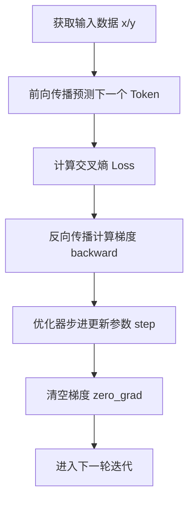

# 预训练的极简迭代流程

大模型在预训练（Pre-training）阶段，核心机制是**自监督的自回归训练（Next-Token Prediction）**。每一轮参数更新的极简迭代流程如下：

## 1. 核心步骤梳理



1. **获取 Batch 数据 (`x`, `y`)**
   - 比如有一句话 `"今天天气真不错"`，若输入为 `x = ["今天", "天气", "真"]`，对应的预测目标则是 `y = ["天气", "真", "不错"]`。通过数据右移构造输入输出。
2. **模型前向传播（Forward）**
   - 将 `x` 输入模型，模型预测下一个位置的 Token 概率分布。
3. **计算损失（Loss）**
   - 将模型的预测分布与真实标签 `y` 进行对比，计算交叉熵损失（Cross Entropy Loss）。
4. **反向传播计算梯度（Backward）**
   - 通过 `loss.backward()`，计算 Loss 对模型每个参数的偏导数（梯度），确定每个参数应该如何调整。
5. **优化器步进修改参数（Optimizer Step）**
   - 调用 `optimizer.step()`，根据计算出的梯度以及学习率，使用优化算法（如 AdamW/Muon）更新模型的权重参数。
6. **清空梯度（Zero Grad）**
   - 调用 `optimizer.zero_grad()`（或 `model.zero_grad()`）将累积的梯度清零，避免干扰下一次迭代的梯度计算。
7. **进入下一步迭代**
   - 载入下一个 batch 的数据，重复上述过程。

---

## 2. PyTorch 伪代码示例

在实际代码中，这个过程通常对应如下的经典训练循环：

```python
for x, y in dataloader:
    # 1. 前向传播计算 logits
    logits = model(x) 
    
    # 2. 计算损失
    loss = criterion(logits.view(-1, vocab_size), y.view(-1))
    
    # 3. 反向传播计算梯度
    loss.backward()
    
    # 4. 优化器更新参数
    optimizer.step()
    
    # 5. 清空梯度
    optimizer.zero_grad()
```