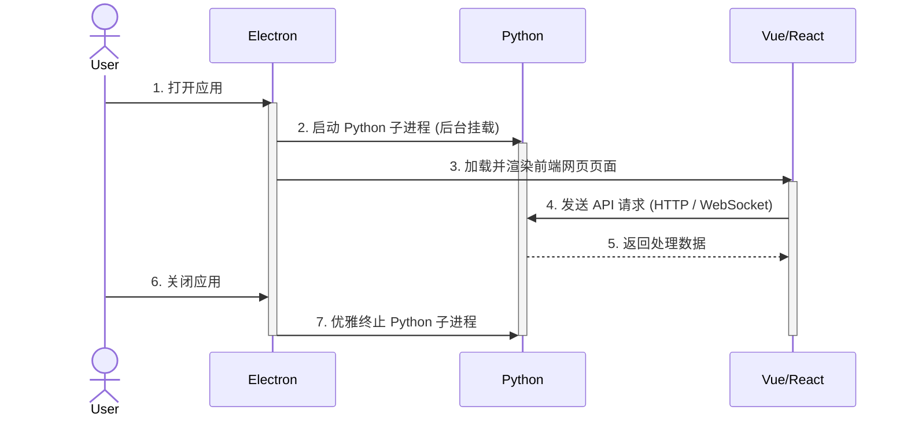

# 前后端分离与 Electron 桌面打包架构

此笔记总结了使用 Vue/React 前端、Python 后端结合 Electron 构建桌面应用的设计架构与打包方案。

## 1. 架构核心一句话总结

> **Vue/React 负责界面展示，Python 负责核心业务，Electron 负责把网页界面封装为桌面软件，electron-builder 负责将所有内容打包生成安装文件。**

## 2. 技术栈分工与协作

| 技术组件 | 角色定位 | 核心职责 |
| :--- | :--- | :--- |
| **Vue / React** | 前端界面 | UI 展示、用户交互逻辑。 |
| **Python** | 后端服务 | 数据处理、AI 推理、爬虫、核心算法与本地数据库。 |
| **Electron** | 桌面宿主外壳 | 创建桌面窗口，调用本地操作系统 API，管理 Python 子进程生命周期。 |
| **electron-builder**| 打包分发工具 | 负责将前端静态资源、Electron 运行时、Python 可执行程序打包为跨平台的安装包（`.exe`, `.dmg`, `AppImage` 等）。 |

---

## 3. 系统协作与运行流程

Python 服务与 Electron 界面通常作为独立进程运行，两者通过本地网络协议进行通信（通常是 **HTTP** 或 **WebSocket**）。

## 4. 用户安装与交付体验

对于最终用户而言，内部技术栈的复杂性被隐藏起来，他们只需要下载并安装一个交付件：
- Windows: `MyApp-Setup.exe`
- macOS: `MyApp.dmg`

> 💡 **形象比喻**：
> - **Electron** 是“精美的桌面车壳”。
> - **Vue / React** 是“车内的仪表盘与交互界面”。
> - **Python** 是“发动机（提供核心动力与数据计算）”。
> - **electron-builder** 是汽车出厂前的“打包机（整车装配出厂）”。
