# 架构演进关键阶段

这篇笔记整理一个典型互联网系统从早期单体到云原生的架构演进过程。重点不是背某一种固定架构，而是理解：系统架构通常是随着业务规模、流量压力、团队协作和运维复杂度不断演进出来的。

资料来源：[互联网架构就这？1个故事讲清楚](https://www.bilibili.com/video/BV1M15Q6eEhL/?share_source=copy_web&vd_source=9072379931fb6eb7d1e9c65fef22fd2f)

## 一句话主线

架构演进不是为了“越来越高级”，而是随着业务规模增长，把瓶颈逐层拆出来：

```text
先拆应用压力
再拆数据库压力
再拆静态资源、搜索和复杂查询
再拆业务边界
最后拆部署、运维和资源调度问题
```

每一次演进都解决一个主要矛盾，同时也会引入新的复杂度。

## 总览图

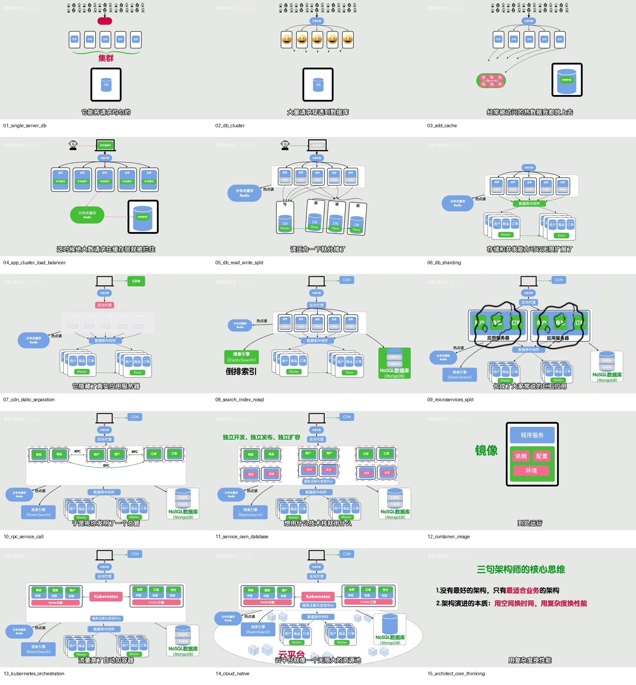

## 1. 单体应用 + 单数据库

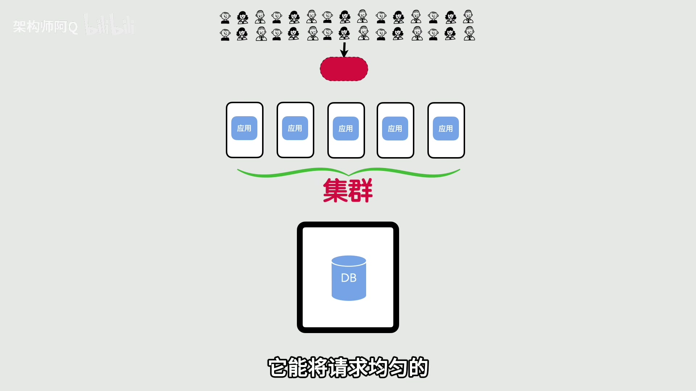

早期系统通常是最简单的形态：

```text
用户 -> 应用服务器 -> 数据库
```

这种架构的优点是简单：

- 开发简单
- 部署简单
- 链路短
- 问题定位容易
- 适合快速验证业务

但随着用户量增长，问题也会暴露：

- 应用服务器成为瓶颈
- 数据库压力集中
- 数据库存在单点风险
- 读写都打到同一个库

这一阶段的核心目标是：先跑通业务。

## 2. 数据库集群

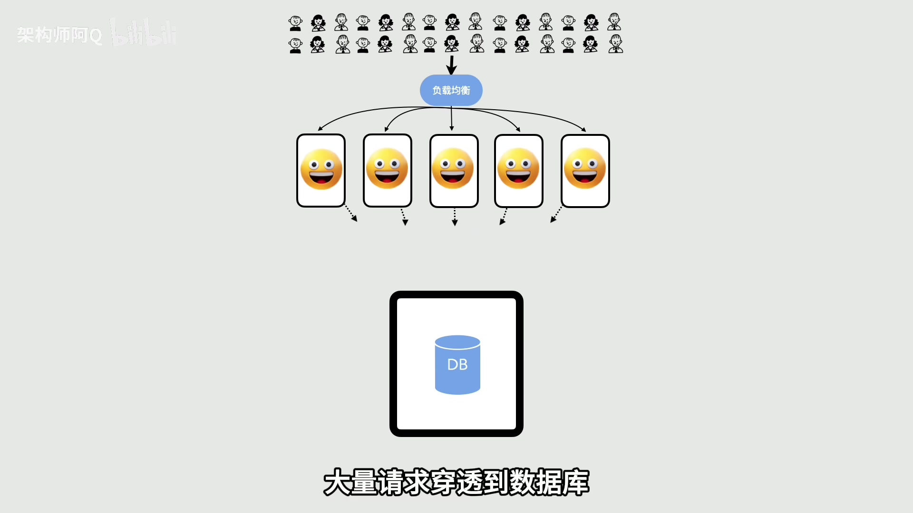

当单数据库扛不住时，会尝试引入数据库集群，提高数据库层的容量和可靠性。

它解决的问题：

- 单数据库容量有限
- 单点故障风险高
- 数据库连接和查询压力集中

但它没有彻底解决应用侧访问数据库压力大的问题。应用仍然可能频繁查询数据库，数据库仍然是核心瓶颈。

这一阶段说明一个规律：

> 只扩数据库本身，不一定能解决数据库访问压力；还要减少不必要的数据库访问。

## 3. 引入缓存

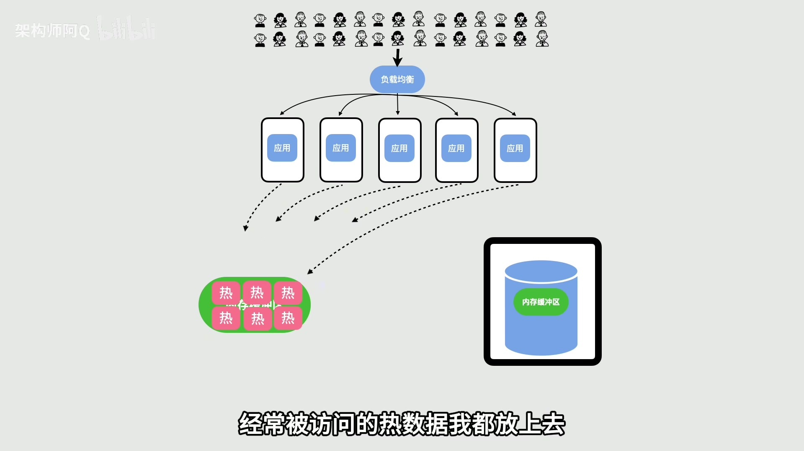

缓存的作用是把热点数据放到更快的存储里，减少数据库读压力。

典型链路变成：

```text
用户 -> 应用服务器 -> 缓存
                    -> 数据库
```

缓存解决的问题：

- 热点数据频繁访问
- 数据库读压力过大
- 部分请求不需要每次都查数据库

但缓存会引入新问题：

- 缓存一致性
- 缓存失效策略
- 缓存击穿
- 缓存穿透
- 缓存雪崩

这一阶段的核心权衡是：

> 用额外存储和一致性复杂度，换取更低的数据库读压力和更快的响应。

## 4. 应用集群 + 负载均衡

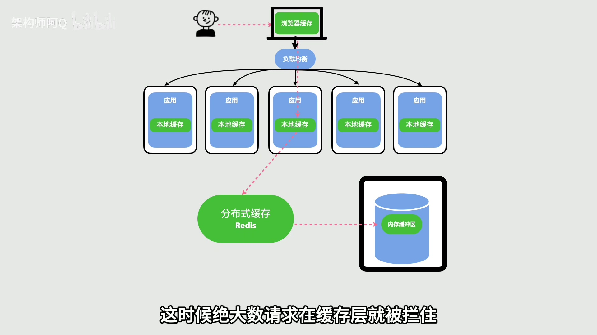

当单台应用服务器扛不住流量时，需要把应用层横向扩展成多台机器，再通过负载均衡分发请求。

典型结构：

```text
用户 -> 负载均衡 -> 应用服务器集群 -> 缓存 / 数据库
```

它解决的问题：

- 单应用服务器 CPU / 内存 / 连接数瓶颈
- 应用层可用性不足
- 需要横向扩容

但它也引入新问题：

- 分布式 session
- 本地缓存失效
- 多实例部署一致性
- 流量分发策略
- 实例健康检查

这一阶段的核心是应用层可伸缩。

## 5. 数据库读写分离

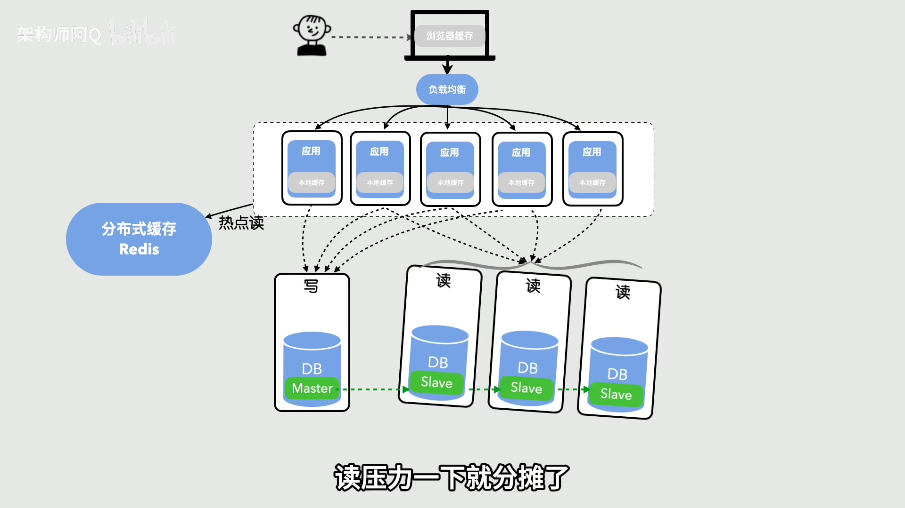

很多业务读多写少。数据库读写分离就是让写请求进入主库，读请求进入从库。

典型结构：

```text
写请求 -> Master
读请求 -> Slave
```

它解决的问题：

- 主库读压力过大
- 读请求可以横向扩展
- 提高整体数据库吞吐

但会引入：

- 主从延迟
- 读一致性问题
- 哪些请求必须读主库
- 复制故障处理

这一阶段最重要的概念是：

> 读写分离提升读能力，但牺牲的是一部分实时一致性和访问复杂度。

## 6. 分库分表

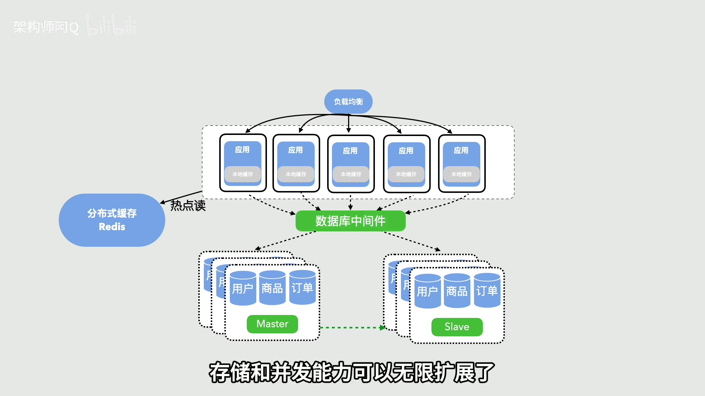

当单库单表的数据量和并发都太高时，就需要分库分表。

它解决的问题：

- 单表数据量过大
- 单库写入能力不足
- 索引和查询性能下降
- 存储容量扩展困难

常见方式：

- 按用户 ID 分片
- 按时间分表
- 按业务维度拆库
- 使用数据库中间件路由请求

代价也很明显：

- 跨库查询复杂
- 分布式事务复杂
- 全局唯一 ID
- 聚合统计困难
- 扩容和数据迁移困难

这一阶段的核心权衡是：

> 分库分表扩展了数据库容量和写入能力，但显著提高了查询、事务和运维复杂度。

## 7. CDN + 静态资源分离

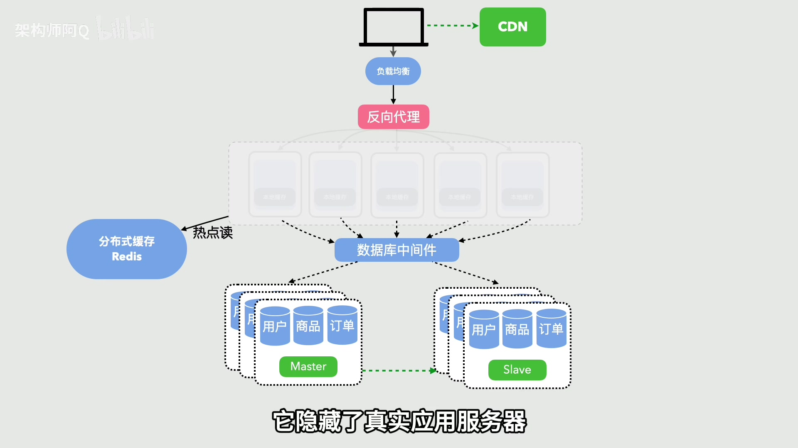

图片、CSS、JS、视频等静态资源不应该全部回源到应用服务器。CDN 可以让静态资源靠近用户，降低源站压力。

它解决的问题：

- 静态资源访问量大
- 用户地域分布广
- 源站带宽压力高
- 页面加载慢

代价是：

- 缓存刷新管理
- 资源版本管理
- 动静分离
- CDN 回源策略

这一阶段说明：不是所有请求都应该进入应用系统。能在边缘解决的，就不要压到源站。

## 8. 搜索索引 + NoSQL

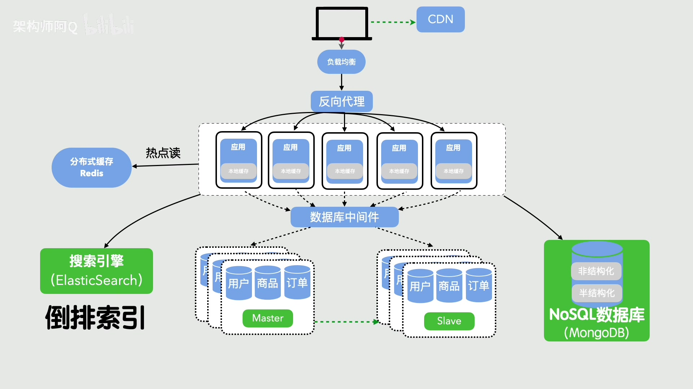

关系型数据库不适合承担所有查询压力。全文搜索、多维筛选、复杂统计、海量非结构化数据，常常需要拆到专门系统。

典型组件：

- 搜索引擎
- NoSQL
- 列式存储
- 分析型数据库
- 日志系统

它解决的问题：

- 复杂查询拖慢主库
- 全文搜索能力弱
- 数据结构不固定
- 统计分析影响在线交易

但会引入：

- 数据同步
- 索引延迟
- 多份数据一致性
- 查询结果不是强一致

这一阶段的核心思想是：

> 不同类型的数据访问模式，应该交给不同类型的存储系统。

## 9. 单体拆成微服务

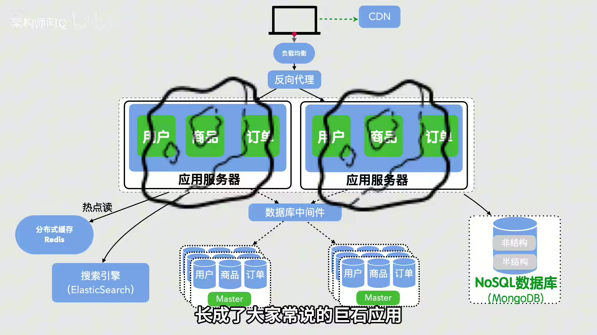

当业务越来越复杂，单体应用会变成大泥球：

- 模块耦合严重
- 发版互相影响
- 团队协作冲突
- 局部变更需要整体部署
- 故障边界不清晰

微服务拆分的目标是按业务边界拆分系统，让不同服务可以独立开发、测试、部署和扩展。

它解决的问题：

- 业务模块解耦
- 团队边界清晰
- 服务可以独立演进
- 不同模块可按需扩容

但微服务不是免费午餐，会引入：

- 服务治理
- 服务发现
- 配置管理
- 分布式事务
- 链路追踪
- 网络延迟
- 故障传播

这一阶段的核心判断是：

> 微服务主要解决组织协作和业务边界问题，不只是性能问题。

## 10. RPC 服务调用

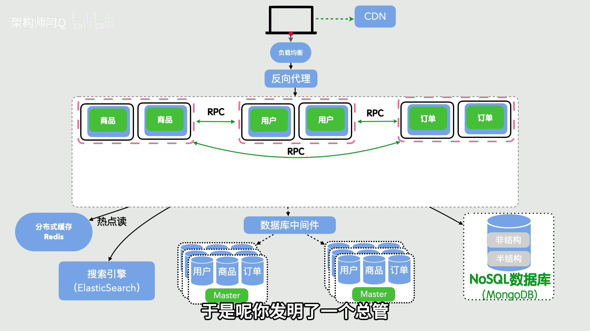

服务拆开之后，服务之间需要通信。RPC 让服务通过接口互相调用，形成内部服务网络。

它解决的问题：

- 服务之间需要标准调用方式
- 接口契约需要明确
- 服务调用要有超时、重试、负载均衡等能力

但会带来：

- 接口版本管理
- 超时和重试风暴
- 服务发现
- 熔断降级
- 链路追踪
- 调用依赖复杂化

这一阶段的关键是：

> 服务拆分之后，真正的复杂度会转移到服务通信和服务治理上。

## 11. 服务独立开发、发布和存储

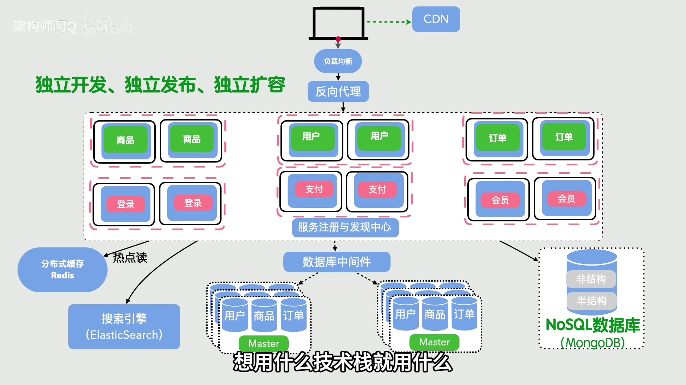

更彻底的微服务不仅代码独立，数据库也应尽量按服务边界隔离。

它带来的好处：

- 服务自治
- 团队职责清晰
- 发布边界明确
- 数据模型贴近业务上下文
- 单个服务故障不直接拖垮所有模块

但也会带来：

- 跨服务数据一致性
- 分布式事务
- 数据同步
- 反范式查询
- 业务流程编排

这一阶段的核心是：

> 服务边界不仅是代码边界，也是数据所有权边界。

## 12. 镜像化

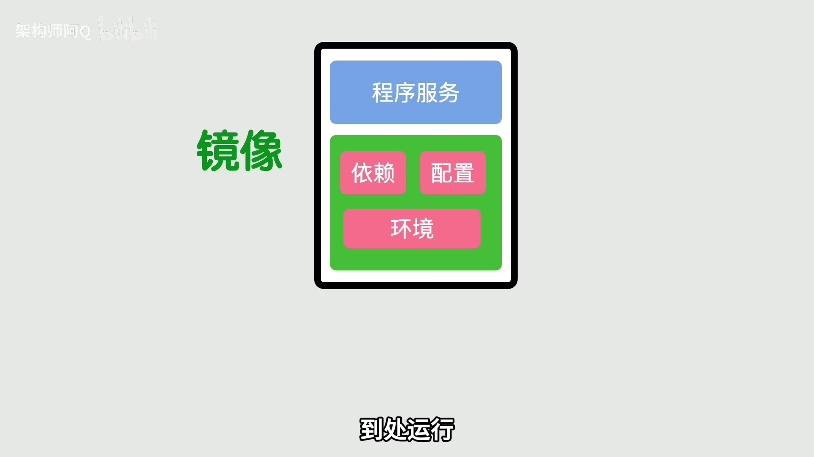

服务越来越多后，部署环境一致性成为问题。镜像化把程序、依赖、运行环境打包成统一镜像。

它解决的问题：

- 开发、测试、生产环境不一致
- 依赖安装复杂
- 服务部署流程不统一
- 回滚困难

代价是：

- 镜像构建治理
- 镜像版本管理
- 镜像仓库安全
- 基础镜像维护

这一阶段的核心价值是：

> 镜像把“运行环境”变成可交付、可版本化的产物。

## 13. 容器编排 / Kubernetes

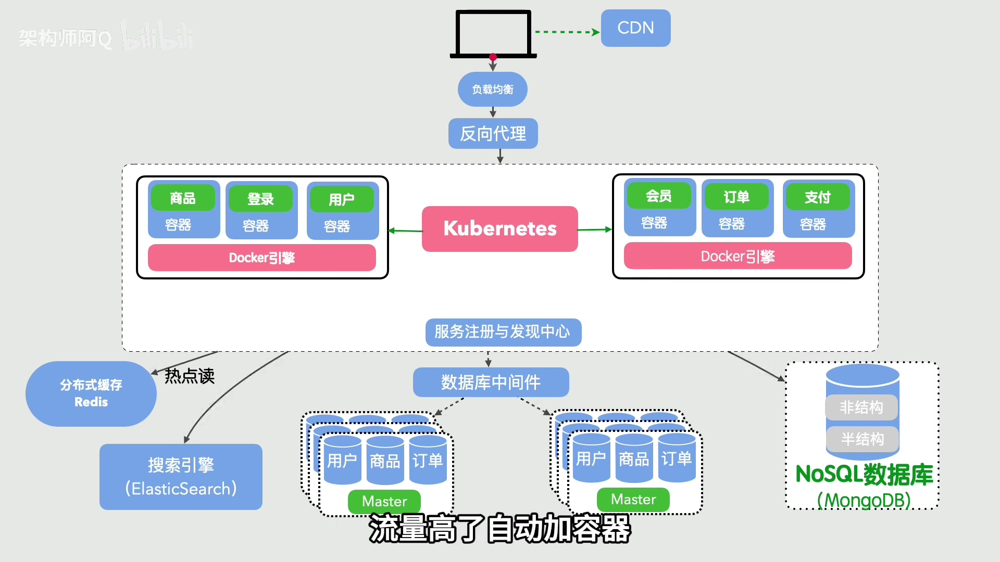

当服务和容器数量变多后，手工部署和维护容器会变得不可控。容器编排系统负责自动调度、扩缩容、滚动发布和故障恢复。

Kubernetes 解决的问题：

- 服务部署
- 实例调度
- 自动扩缩容
- 滚动发布
- 服务发现
- 自愈
- 配置和密钥管理

但它也引入平台复杂度：

- 学习成本高
- 集群运维复杂
- YAML 和资源模型复杂
- 网络、存储、安全策略复杂

这一阶段的核心权衡是：

> 用平台复杂度换取大规模服务部署、调度和自愈能力。

## 14. 云平台 / 云原生

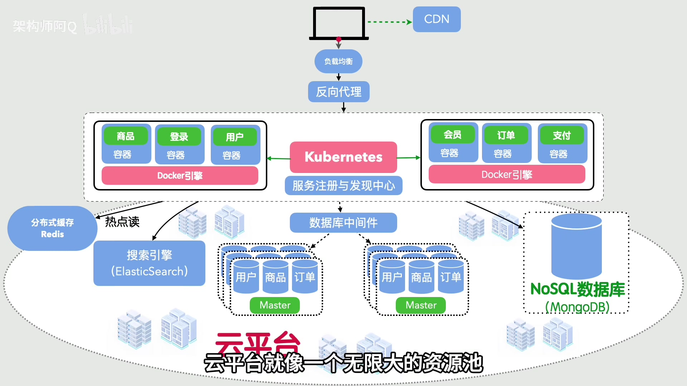

云原生把基础设施进一步抽象成弹性资源池。计算、存储、网络、数据库、中间件、监控、日志都可以按需使用。

它解决的问题：

- 资源弹性
- 快速交付
- 自动化运维
- 全球化部署
- 托管服务减少自运维成本

但也有新问题：

- 云成本治理
- 平台锁定
- 权限治理
- 多云复杂度
- 可观测性和安全要求更高

这一阶段的核心是：

> 云原生不是简单“上云”，而是围绕弹性、自动化、托管服务和平台能力重新组织系统。

## 15. 架构师核心思维

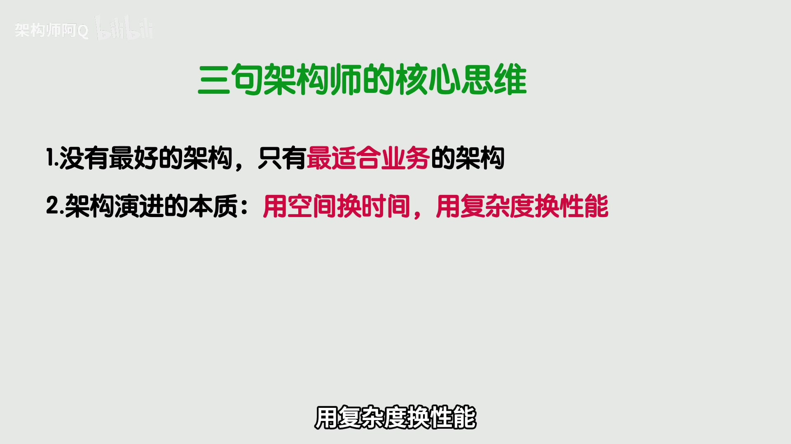

架构演进背后的核心不是某个技术名词，而是取舍。

可以总结成三句话：

```text
1. 没有绝对最优的架构，只有当前业务阶段最合适的架构。

2. 架构演进的本质，是在性能、复杂度、成本与稳定性之间做权衡。

3. 架构设计始终围绕五大目标：
   高性能、高可用、可伸缩、可扩展、足够安全。
```

## 阶段总表

| 阶段 | 架构变化 | 主要解决的问题 | 主要代价 |
|---:|---|---|---|
| 1 | 单体应用 + 单数据库 | 快速跑通业务 | 单点瓶颈明显 |
| 2 | 数据库集群 | 缓解单库容量和可靠性问题 | 数据库访问压力仍集中 |
| 3 | 引入缓存 | 降低数据库读压力 | 缓存一致性和失效策略 |
| 4 | 应用集群 + 负载均衡 | 扩展应用层吞吐 | 分布式 session 和多实例状态 |
| 5 | 数据库读写分离 | 提高数据库读能力 | 主从延迟和读一致性 |
| 6 | 分库分表 | 扩展存储和写入能力 | 跨库查询、事务、统计复杂 |
| 7 | CDN + 静态资源分离 | 降低源站和带宽压力 | 缓存刷新和资源版本管理 |
| 8 | 搜索索引 + NoSQL | 拆出复杂查询和搜索 | 数据同步和索引一致性 |
| 9 | 微服务拆分 | 业务模块解耦 | 服务治理和分布式复杂度 |
| 10 | RPC 服务调用 | 标准化服务通信 | 超时、重试、服务发现 |
| 11 | 服务独立存储 | 明确服务和数据边界 | 数据一致性和协作规范 |
| 12 | 镜像化 | 解决环境不一致 | 镜像治理 |
| 13 | Kubernetes 编排 | 自动部署、扩缩容、自愈 | 平台复杂度上升 |
| 14 | 云原生 | 弹性资源和托管服务 | 云成本、锁定和治理 |
| 15 | 架构思维总结 | 建立取舍意识 | 没有银弹 |

## 最后理解

架构演进不是固定路线图。不是每个系统都要从单体走到微服务，再走到 Kubernetes 和云原生。

真正要理解的是：

- 当前瓶颈在哪里？
- 这个阶段最重要的问题是什么？
- 引入新架构能解决什么？
- 它会带来什么新复杂度？
- 这个复杂度现在值得承担吗？

如果这些问题答不清楚，架构升级就很容易变成技术堆砌。
